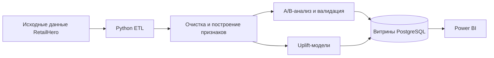

# Retail Experimentation & Uplift Analytics Platform

End-to-end платформа для оценки маркетингового эксперимента в ритейле, исследования неоднородности эффекта воздействия и построения экономически обоснованной стратегии таргетинга. Python отвечает за статистические и ML-расчёты, PostgreSQL — за аналитические витрины, Power BI — за визуализацию и интерактивный анализ.

> Статус: **реализованы data layer, feature mart, A/B-анализ, валидация эксперимента и baseline uplift-модели.** Исходные файлы пока отсутствуют, поэтому фактический эффект кампании и качество моделей не рассчитаны.

## Бизнес-задача

Платформа должна определить:

- приводит ли маркетинговая коммуникация к росту конверсии;
- насколько надёжна оценка эффекта и достаточен ли размер выборки;
- различается ли эффект между сегментами клиентов;
- каким клиентам коммуникация действительно меняет вероятность покупки;
- может ли uplift-таргетинг повысить ожидаемую прибыль по сравнению с коммуникацией со всей аудиторией.

## Архитектура



Тяжёлые статистические вычисления выполняются в Python. PostgreSQL хранит контролируемые результаты и выполняет отчётные агрегации. Power BI получает готовые аналитические таблицы и отвечает за визуализацию, фильтрацию и What-if сценарии.

## Данные

Проект рассчитан на набор данных X5 RetailHero Uplift, включающий клиентов, товары, покупки, назначения в группы эксперимента и целевой результат (`uplift_train`). Исходные данные не распространяются вместе с репозиторием. Инструкция по их размещению находится в [data/raw/README.md](data/raw/README.md).

Названия и типы полей будут документироваться только после чтения реальных файлов. Проект не предполагает заранее выдуманную схему источников.

## Дизайн эксперимента

Единица анализа — клиент, случайным образом назначенный в treatment или control. Основная метрика — Conversion Rate. Основная двусторонняя гипотеза сравнивает две независимые доли. Контроль качества эксперимента включает SRM, A/A-симуляцию, оценку мощности, MDE и bootstrap-анализ неопределённости.

## Методология

1. Очистка данных и профилирование источников.
2. Клиентская витрина и RFM-признаки, построенные только на pre-treatment данных.
3. Переиспользуемый модуль A/B-тестирования двух долей.
4. SRM, A/A, power analysis, bootstrap и анализ сегментов с поправкой на множественные сравнения.
5. Базовые S-Learner и T-Learner с последующим обоснованным сравнением с градиентным бустингом.
6. Оценка на отложенной выборке с помощью Qini, AUUC и uplift по децилям.
7. Оптимизация порога таргетинга с учётом unit economics.
8. Аналитические витрины PostgreSQL и документированная модель Power BI.

## A/B-тестирование и валидация эксперимента

Рассчитываемые показатели:

- размеры treatment и control;
- конверсия в каждой группе;
- абсолютный и относительный uplift;
- стандартная ошибка, z-статистика и p-value;
- доверительный интервал и размер эффекта;
- мощность, требуемый размер выборки и MDE;
- диагностика SRM и A/A;
- bootstrap-распределение uplift.

Для сегментного анализа применяется поправка Benjamini–Hochberg. Выводы не строятся только на нескорректированных p-value отдельных сегментов.

## Построение признаков

Признаки клиентов будут строиться исключительно по информации, доступной до начала эксперимента. Планируемые группы признаков: демография, траты, частота и давность покупок, товарное поведение, скидки и RFM. Точная реализация зависит от фактической схемы и временных полей источника — это необходимо для предотвращения target leakage.

## Uplift-моделирование и оценка

Реализованы S-Learner и T-Learner на основе логистической регрессии. Качество оценивается на стратифицированном holdout по uplift curve, Qini curve, Qini coefficient, AUUC и таблицам децилей, а не по обычным predictive метрикам. После оценки модели переобучаются на всей витрине для клиентского scoring. Predicted uplift является модельной оценкой, а не наблюдаемым индивидуальным counterfactual-исходом.

## Оценка бизнес-эффекта

Стратегии Target All и Uplift Targeting будут сравниваться при настраиваемых параметрах стоимости коммуникации, прибыли с конверсии и порога таргетинга. Если подтверждённые данные о марже отсутствуют, все денежные результаты будут явно помечены как сценарный анализ.

## Dashboard Power BI

Планируется пять страниц отчёта:

1. Executive Overview.
2. Experiment Diagnostics.
3. Customer Segments.
4. Uplift Modeling.
5. Business Impact.

Статистические и модельные показатели рассчитываются до загрузки в Power BI.

## Технологии

Python 3.12, Polars, pandas, NumPy, SciPy, statsmodels, scikit-learn, PostgreSQL 16, SQLAlchemy, pytest, Docker Compose и Power BI.

## Структура репозитория

```text
data/
  raw/               # исходные файлы, исключённые из Git
  interim/           # промежуточные результаты очистки
  processed/         # подготовленные аналитические наборы
src/
  config/settings.py # конфигурация из переменных окружения
  data/loader.py        # lazy-загрузка и исследование схем
  data/quality.py       # профили качества и EDA-таблицы
  data/preprocessing.py # очистка, аудит и orchestration Stage 2
  data/database.py      # фабрика подключения к PostgreSQL
  features/schema.py    # mapping фактических колонок на семантические роли
  features/rfm.py       # RFM scores и сегмент
  features/customer_features.py # клиентская feature mart
  experiments/metrics.py        # CR и uplift-метрики
  experiments/ab_test.py        # two-proportion z-test и orchestration
  experiments/confidence_intervals.py
  experiments/power.py          # power, sample size и MDE
  experiments/srm.py            # Sample Ratio Mismatch
  experiments/aa_test.py        # A/A-симуляции
  experiments/bootstrap.py      # bootstrap uncertainty uplift
  experiments/segment_analysis.py
  experiments/validation.py     # orchestration валидации
  models/preprocessing.py       # единый feature preprocessing
  models/s_learner.py           # S-Learner baseline
  models/t_learner.py           # T-Learner baseline
  models/uplift_metrics.py      # Qini, AUUC и децильные таблицы
  models/model_evaluation.py    # holdout evaluation и scoring
notebooks/01_data_overview.ipynb
notebooks/02_ab_analysis.ipynb
notebooks/03_experiment_validation.ipynb
notebooks/05_uplift_modeling.ipynb
docs/stage_02_data_cleaning.md
docs/stage_03_customer_feature_mart.md
docs/stage_04_ab_testing.md
docs/stage_05_experiment_validation.md
docs/uplift_modeling.md
tests/                  # unit- и интеграционные тесты
sql/ddl/00_init.sql     # начальная настройка схем базы данных
Dockerfile
docker-compose.yml
requirements.txt
```

Основная логика данных, экспериментов и моделей находится в `src/`; notebook используются только для объяснения и визуализации. Пустые файлы-заглушки намеренно не создаются.

## Запуск проекта

Требования: Python 3.11 или новее (рекомендуется 3.12), опционально Docker Desktop.

```bash
python -m venv .venv
# Windows: .venv\Scripts\activate
# macOS/Linux: source .venv/bin/activate
pip install -r requirements.txt
copy .env.example .env  # в macOS/Linux используйте `cp`
python -m src.data.loader
```

Пока четыре файла источника не размещены в `data/raw/`, последняя команда намеренно завершается понятной ошибкой с инструкцией. После добавления данных запустите Stage 2:

```bash
python -m src.data.preprocessing
```

Описание политики очистки и выходных артефактов находится в [docs/stage_02_data_cleaning.md](docs/stage_02_data_cleaning.md). После изучения фактической схемы заполните mapping и запустите Stage 3:

```bash
python -m src.features.customer_features --mapping customer_feature_schema.json
```

Формулы, leakage guard и правила mapping описаны в [docs/stage_03_customer_feature_mart.md](docs/stage_03_customer_feature_mart.md). После материализации витрины запустите Stage 4:

```bash
python -m src.experiments.ab_test
```

Методология inference, power analysis и тестовая стратегия описаны в [docs/stage_04_ab_testing.md](docs/stage_04_ab_testing.md). После Stage 4 запустите полный validation layer:

```bash
python -m src.experiments.validation
```

SRM, A/A, bootstrap, сегментные эффекты и их тесты описаны в [docs/stage_05_experiment_validation.md](docs/stage_05_experiment_validation.md). Для обучения и честной holdout-оценки uplift-моделей выполните:

```bash
python -m src.models.model_evaluation
```

Формулы, защита от leakage, артефакты и тестовая стратегия описаны в [docs/uplift_modeling.md](docs/uplift_modeling.md). Запуск PostgreSQL:

```bash
docker compose up -d postgres
docker compose ps
```

Проверка схем источников внутри контейнера после добавления данных:

```bash
docker compose --profile tools run --rm pipeline
```

## Ограничения

- В текущем checkout отсутствуют исходные файлы и их фактические схемы.
- Фактические статистические результаты, качество моделей и бизнес-эффект ещё не рассчитаны без исходных данных.
- Стандартные Docker credentials предназначены только для локальной разработки и должны быть заменены в другой среде.
- Аналитические DDL должны строиться только после проверки фактических выходных схем.
