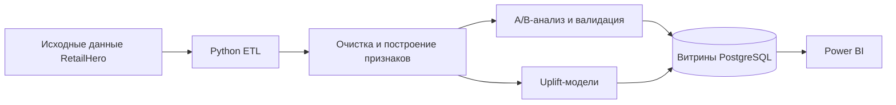

# Retail Experimentation & Uplift Analytics Platform

End-to-end платформа для оценки маркетингового эксперимента в ритейле, исследования неоднородности эффекта воздействия и построения экономически обоснованной стратегии таргетинга. Python отвечает за статистические и ML-расчёты, PostgreSQL — за аналитические витрины, Power BI — за визуализацию и интерактивный анализ.

> Статус: **Stage 1 завершён — создана основа проекта и инфраструктура.** Результаты эксперимента не публикуются до анализа реальных данных X5 RetailHero.

## Бизнес-задача

Платформа должна определить:

- приводит ли маркетинговая коммуникация к росту конверсии;
- насколько надёжна оценка эффекта и достаточен ли размер выборки;
- различается ли эффект между сегментами клиентов;
- каким клиентам коммуникация действительно меняет вероятность покупки;
- может ли uplift-таргетинг повысить ожидаемую прибыль по сравнению с коммуникацией со всей аудиторией.

## Архитектура



Тяжёлые статистические вычисления выполняются в Python. PostgreSQL хранит контролируемые результаты и выполняет отчётные агрегации. Power BI получает готовые аналитические таблицы и отвечает за визуализацию, фильтрацию и What-if сценарии.

## Данные

Проект рассчитан на набор данных X5 RetailHero Uplift, включающий клиентов, товары, покупки, назначения в группы эксперимента и целевой результат (`uplift_train`). Исходные данные не распространяются вместе с репозиторием. Инструкция по их размещению находится в [data/raw/README.md](data/raw/README.md).

Названия и типы полей будут документироваться только после чтения реальных файлов. Проект не предполагает заранее выдуманную схему источников.

## Дизайн эксперимента

Единица анализа — клиент, случайным образом назначенный в treatment или control. Основная метрика — Conversion Rate. Основная двусторонняя гипотеза сравнивает две независимые доли. Контроль качества эксперимента будет включать SRM, A/A-симуляцию, оценку мощности, MDE и bootstrap-анализ неопределённости.

## Методология и порядок разработки

1. Очистка данных и профилирование источников.
2. Клиентская витрина и RFM-признаки, построенные только на pre-treatment данных.
3. Переиспользуемый модуль A/B-тестирования двух долей.
4. SRM, A/A, power analysis, bootstrap и анализ сегментов с поправкой на множественные сравнения.
5. Базовые S-Learner и T-Learner с последующим обоснованным сравнением с градиентным бустингом.
6. Оценка на отложенной выборке с помощью Qini, AUUC и uplift по децилям.
7. Оптимизация порога таргетинга с учётом unit economics.
8. Аналитические витрины PostgreSQL и документированная модель Power BI.

## A/B-тестирование и валидация эксперимента

Планируемые результаты:

- размеры treatment и control;
- конверсия в каждой группе;
- абсолютный и относительный uplift;
- стандартная ошибка, z-статистика и p-value;
- доверительный интервал и размер эффекта;
- мощность, требуемый размер выборки и MDE;
- диагностика SRM и A/A;
- bootstrap-распределение uplift.

Для сегментного анализа будет применяться поправка Benjamini–Hochberg. Выводы не будут строиться только на нескорректированных p-value отдельных сегментов.

## Построение признаков

Признаки клиентов будут строиться исключительно по информации, доступной до начала эксперимента. Планируемые группы признаков: демография, траты, частота и давность покупок, товарное поведение, скидки и RFM. Точная реализация зависит от фактической схемы и временных полей источника — это необходимо для предотвращения target leakage.

## Uplift-моделирование и оценка

Интерпретируемыми baseline-моделями будут S-Learner и T-Learner на основе логистической регрессии. Модели будут оцениваться по uplift curve, Qini curve, Qini coefficient, AUUC и таблицам децилей, а не только по обычным predictive метрикам. Типы клиентов являются модельной интерпретацией, а не наблюдаемыми индивидуальными counterfactual-исходами.

## Оценка бизнес-эффекта

Стратегии Target All и Uplift Targeting будут сравниваться при настраиваемых параметрах стоимости коммуникации, прибыли с конверсии и порога таргетинга. Если подтверждённые данные о марже отсутствуют, все денежные результаты будут явно помечены как сценарный анализ.

## Dashboard Power BI

Планируется пять страниц отчёта:

1. Executive Overview.
2. Experiment Diagnostics.
3. Customer Segments.
4. Uplift Modeling.
5. Business Impact.

Статистические показатели рассчитываются до загрузки в Power BI. Семантическая модель, связи, форматирование и DAX-меры будут описаны на Stage 9.

## Технологии

Python 3.12, Polars, pandas, NumPy, SciPy, statsmodels, scikit-learn, PostgreSQL 16, SQLAlchemy, pytest, Docker Compose и Power BI.

## Структура репозитория

```text
data/
  raw/               # исходные файлы, исключённые из Git
  interim/           # промежуточные результаты очистки
  processed/         # подготовленные аналитические наборы
src/
  config/settings.py # конфигурация из переменных окружения
  data/loader.py     # lazy-загрузка и исследование схем
  data/database.py   # фабрика подключения к PostgreSQL
sql/ddl/00_init.sql  # начальная настройка схем базы данных
Dockerfile
docker-compose.yml
requirements.txt
```

Модули экспериментов, признаков, моделей, бизнес-логики, notebooks, витрин, документации Power BI и тестов будут наполняться на соответствующих этапах. Пустые файлы-заглушки намеренно не создаются.

## Запуск Stage 1

Требования: Python 3.11 или новее (рекомендуется 3.12), опционально Docker Desktop.

```bash
python -m venv .venv
# Windows: .venv\Scripts\activate
# macOS/Linux: source .venv/bin/activate
pip install -r requirements.txt
copy .env.example .env  # в macOS/Linux используйте `cp`
python -m src.data.loader
```

Пока четыре файла источника не размещены в `data/raw/`, последняя команда намеренно завершается понятной ошибкой с инструкцией. Запуск PostgreSQL:

```bash
docker compose up -d postgres
docker compose ps
```

Проверка схем источников внутри контейнера после добавления данных:

```bash
docker compose --profile tools run --rm pipeline
```

## Ограничения

- В текущем checkout отсутствуют исходные файлы и их фактические схемы.
- Статистические результаты, качество моделей и бизнес-эффект ещё не рассчитаны.
- Стандартные Docker credentials предназначены только для локальной разработки и должны быть заменены в другой среде.
- Полный DDL аналитических витрин будет реализован на Stage 8 после проверки выходных схем.

## Дальнейшее развитие

Stages 2–10 последовательно добавят профилирование, очистку, клиентскую витрину, статистический inference, диагностику эксперимента, uplift-модели, оптимизацию таргетинга, PostgreSQL-витрины, документацию Power BI, тесты и финальную подготовку проекта для портфолио.
