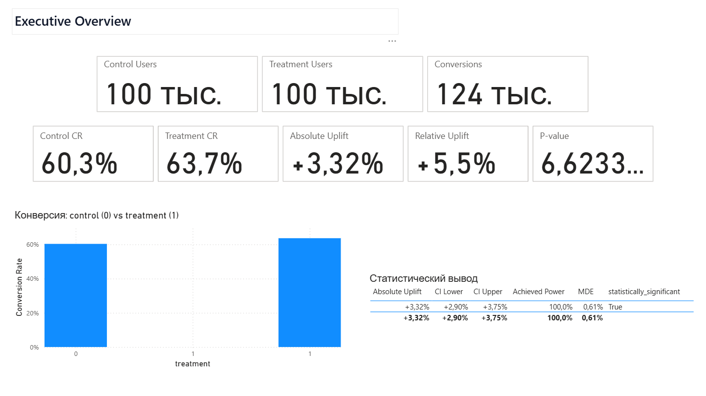
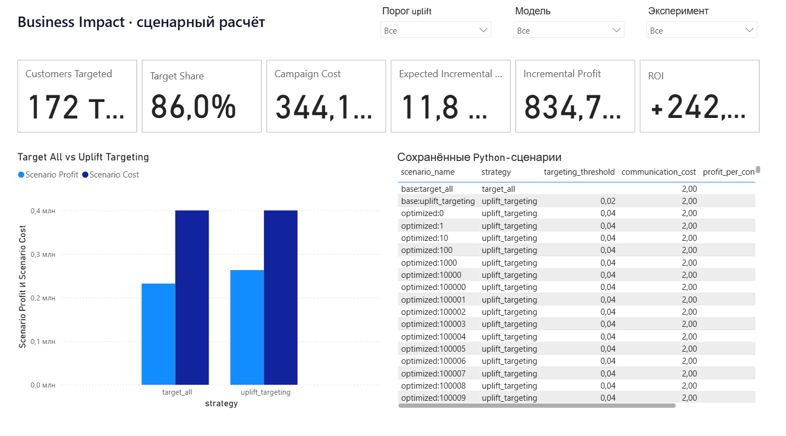

# A/B-тест и выбор аудитории для маркетинговой кампании

Проект на данных X5 RetailHero: разобрал результаты маркетингового эксперимента и попробовал выбрать клиентов, которым стоит отправлять предложение. Вся цепочка — от файлов с покупками до отчёта в Power BI — запускается одной командой.

## Задача

Рассылка стоит денег, а часть клиентов купит и без неё. Хотел разобраться, сколько дополнительных покупок приносит предложение и можно ли получить больше прибыли, если отправлять его только части аудитории.

Для этого подготовил данные, проверил эффект кампании, сравнил две модели и посчитал экономику рассылки. Это портфолио-проект на публичных данных: сам эксперимент уже был проведён, я работал с его результатами.

## Что сделал

- Обработал **45,8 млн строк покупок** и собрал таблицу на **200 039 клиентов с 21 признаком**: траты, частота и давность покупок, товарные предпочтения.
- Провёл A/B-анализ, проверил баланс групп и устойчивость результата.
- Обучил две uplift-модели. Они оценивают, насколько предложение может изменить вероятность покупки конкретного клиента.
- Сравнил рассылку всей базе с выбором аудитории по модели, добавил подбор порога с учётом затрат.
- Собрал пять страниц Power BI и витрины PostgreSQL. Настроил запуск через Docker и написал тесты для расчётов.

## Что получилось

### Предложение увеличило конверсию

В контрольной группе было 100 058 клиентов, в группе с предложением — 99 981.

| | Без предложения | С предложением |
| --- | ---: | ---: |
| Конверсия | 60,33% | 63,65% |

Разница — **+3,32 процентного пункта**, или **+5,51% относительно контроля**. Это примерно 33 дополнительных покупки на каждую тысячу клиентов. Эффект статистически значим: 95% доверительный интервал разницы — от +2,90 до +3,75 п. п. Проверка повторными расчётами дала близкий результат.



На первой странице отчёта собраны размеры групп, конверсия и оценка эффекта. На карточке Absolute Uplift разница показана со знаком %, читать её нужно как процентные пункты.

### Выбор аудитории оказался выгоднее в расчётном сценарии

Модели сравнил на 60 012 клиентах, которые не участвовали в обучении. Лучше сработал T-Learner — его и использовал для расчёта.

Условия сценария: контакт стоит **2 денежные единицы**, дополнительная покупка приносит **100**. Предложение отправляем клиентам, для которых модель прогнозирует рост вероятности покупки больше чем на 2 п. п.

| Показатель | Рассылка всем | Аудитория по модели |
| --- | ---: | ---: |
| Клиентов для рассылки | 200 039 | 121 167 |
| Расходы, ден. ед. | 400 078 | 242 334 |
| Ожидаемые дополнительные покупки | 6 327 | 5 859 |
| Ожидаемая прибыль после расходов, ден. ед. | 232 652 | 343 582 |
| ROI | 58,2% | 141,8% |

В этом сценарии можно сократить расходы на **39,4%**, сохранив около **92,6% дополнительных покупок**. Ожидаемая прибыль при этом выше на **47,7%**.

Это прогноз по модели и заданным условиям. Чтобы проверить такую стратегию на практике, нужен новый эксперимент с выбранной аудиторией.



На странице Business Impact можно менять параметры и смотреть сохранённые сценарии. На скриншоте фильтры стоят на «Все», поэтому цифры отличаются от таблицы выше: в ней приведён один базовый сценарий для T-Learner.

## Отчёт и инструменты

В Power BI пять страниц: результаты эксперимента, проверки его качества, клиентские сегменты, сравнение моделей и экономика кампании.

**Стек:** Python, Polars, pandas, SciPy, statsmodels, scikit-learn, PostgreSQL, SQL, Power BI / DAX, Docker, pytest.

Расчёты выполняются в Python, результаты хранятся в PostgreSQL, Power BI используется для просмотра и сравнения сценариев. Основной код лежит в `src/`, пояснения к анализу — в `notebooks/`.

## Как запустить

Нужны Windows 10/11, Git, Docker Desktop и Power BI Desktop. Запустите Docker Desktop и выполните:

```powershell
git clone https://github.com/NENN111/A-B-X5.git
cd A-B-X5
powershell -ExecutionPolicy Bypass -File .\scripts\setup_windows.ps1
```

Скрипт скачает данные, выполнит расчёты, загрузит базу и откроет отчёт, если найдёт Power BI Desktop. Отдельный Python не нужен. При первом запуске скачивается около 620 МБ данных.

Если Power BI запросит подключение, выберите **«База данных»**: сервер `localhost:5432`, база `retail_experiments`, пользователь `retail`, пароль для локального запуска `retail_local_only`. Затем нажмите **«Обновить»**.

Файл отчёта: [RetailExperimentation.pbip](powerbi/dashboard/RetailExperimentation.pbip). Ручной запуск и решение проблем описаны в [инструкции](docs/deployment.md).

<details>
<summary>Подробнее о расчётах</summary>

- Признаки построены по покупкам до начала эксперимента (`2019-03-19`), чтобы в модель не попала информация о его результате.
- Для конверсии использован двусторонний тест двух долей при уровне значимости 5%. Проверка баланса групп (SRM): `p = 0,863`.
- В 1 000 A/A-симуляций доля ложных срабатываний составила 4,4%. Bootstrap из 10 000 повторений дал интервал эффекта от +2,89 до +3,75 п. п. Для анализа сегментов применена поправка Benjamini–Hochberg.
- S-Learner и T-Learner построены на логистической регрессии. Разделение на обучение и проверку — 70/30; подготовка признаков обучается только на тренировочных данных. Qini на отложенной выборке: −2,45 у S-Learner и 98,82 у T-Learner.
- После сравнения модели переобучаются на всей базе для выбора аудитории. Эти прогнозы используются в расчёте экономики; качество моделей оценивается на отложенной выборке.
- Числа взяты из сохранённых результатов Python. Исходные данные и рассчитанные таблицы не хранятся в Git — они создаются при запуске.

Документация: [подготовка данных](docs/stage_02_data_cleaning.md), [клиентские признаки](docs/stage_03_customer_feature_mart.md), [A/B-анализ](docs/stage_04_ab_testing.md), [проверки эксперимента](docs/stage_05_experiment_validation.md), [модели](docs/uplift_modeling.md), [экономика](docs/business_optimization.md), [витрины PostgreSQL](docs/postgresql_marts.md).

Тесты в установленном Python-окружении: `python -m pytest`.

</details>
